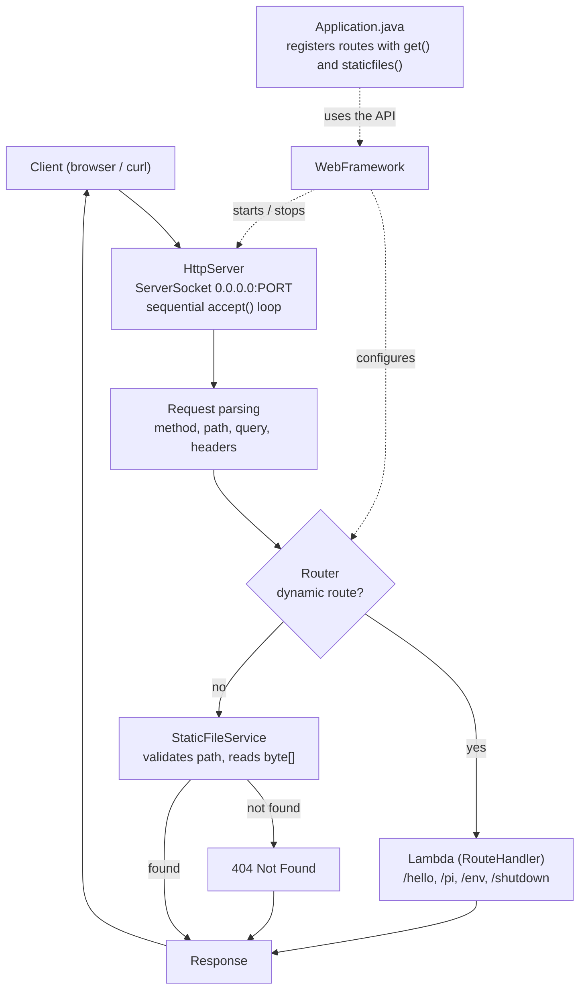

# Mini Web Framework: a Sequential HTTP Application Server in Java

A mini web framework built only with the Java standard library (`java.net`, `java.io`). It lets you register `GET` endpoints with **lambdas**, serve static files (including binaries), read its configuration from **environment variables**, shut down gracefully, and deploy to the cloud with Docker.

> **Cloud platform:** AWS EC2 + Docker  

## Table of contents
1. [Description](#1-project-description)
2. [Architecture](#2-architecture)
3. [Components](#3-component-responsibilities)
4. [Metaphor](#4-metaphor-the-office-building)
5. [Using the framework](#5-using-the-framework)
6. [Running locally](#6-build-and-run-locally)
7. [Environment variables](#7-environment-variables)
8. [AWS deployment](#8-deploying-to-aws-ec2--docker)
9. [Example URLs](#9-example-urls)
10. [Maintainability](#10-why-the-architecture-is-maintainable)
11. [Tests](#11-tests-performed)
12. [Sequential design](#12-design-decision-a-sequential-server)

---

## 1. Project description

The project evolves a socket server that serves static files into a **declarative framework**: the developer registers routes with `get("/path", (req, resp) -> ...)` and never touches the connection loop.

| Capability | Detail |
| :--- | :--- |
| Dynamic routes | `get(path, lambda)`; three examples are included: `/hello`, `/pi`, `/env`. |
| Query string | `req.getValue("name")` decodes UTF-8, supports multiple parameters and returns `null` when a parameter is missing. |
| Static files | HTML, CSS, JS and images (PNG, JPEG, GIF, SVG, ICO) read and sent as `byte[]`. |
| Errors | `400`, `404`, `405` and `500`. A faulty client never stops the server. |
| Security | *Path traversal* is blocked (`..`, `%2e`, `%2f`, `\`, `//`) with a `400`. |
| Configuration | `PORT`, `APP_ENV`, `GREETING_PREFIX`, `STATIC_FILES_PATH`. |
| Shutdown | `/shutdown` exists only when `APP_ENV=development`. |
| Concurrency | **None**: a single thread, one connection at a time. |

### Repository structure

```text
.
├── Dockerfile
├── .dockerignore
├── .gitignore
├── pom.xml
├── README.md
├── docs/evidence/                      # screenshots used in this README
└── src
    ├── main
    │   ├── java/co/edu/escuelaing
    │   │   ├── app/Application.java            # example app (uses the framework)
    │   │   └── webframework/                   # the framework
    │   │       ├── WebFramework.java           # facade: staticfiles, get, start, stop
    │   │       ├── HttpServer.java             # sockets, sequential loop, error handling
    │   │       ├── Router.java                 # (method, path) -> lambda
    │   │       ├── RouteHandler.java           # functional interface
    │   │       ├── Request.java                # method, path, query, getValue()
    │   │       ├── Response.java               # status, headers, body
    │   │       └── StaticFileService.java      # static files + security
    │   └── resources/webroot/                  # index.html, app.js, styles.css, images/logo.png
    └── test/java/co/edu/escuelaing/webframework/   # 4 test classes (JUnit 5)
```

---

## 2. Architecture



**Request flow:** `accept()` → parse → method other than GET: `405` → is there a registered dynamic route? run its lambda (if it throws: `500`) → otherwise try a static file (unsafe path: `400`) → if that does not exist either: `404`. Every response carries an exact `Content-Length` and `Connection: close`, and the client socket is closed before the next `accept()`.

The `webframework` package knows nothing about business routes; only `Application` knows `/hello`, `/pi`, `/env` and `/shutdown`.

---

## 3. Component responsibilities

| Component | Responsibility |
| :--- | :--- |
| `WebFramework` | Public static API: `staticfiles()`, `get()`, `start()`, `start(int)`, `stop()`. Resolves `PORT`. |
| `HttpServer` | `ServerSocket` bound to `0.0.0.0`, `while (running)` loop, 5 s read timeout, request-line and header parsing, mapping to `400/404/405/500`, orderly shutdown. |
| `Router` | Map of `(METHOD, path)` → `RouteHandler`. |
| `RouteHandler` | Functional interface `String handle(Request, Response)`. |
| `Request` | Method, path, raw query and decoded parameters (`getValue`, `getValues`). |
| `Response` | Status, content type, headers and byte body; serialized as HTTP/1.1. |
| `StaticFileService` | Locates resources, detects MIME types, blocks *path traversal*, returns `byte[]`. |
| `Application` | User code: registers routes and reads `APP_ENV` and `GREETING_PREFIX`. |

---

## 4. Metaphor: the office building

The server is an **office building with a single service window**: there is one receptionist, and they attend one visitor at a time.

| Building | Component | Relationship |
| :--- | :--- | :--- |
| Entrance and lobby queue | `ServerSocket` + TCP backlog | Visitors wait their turn in line. |
| Single receptionist | `HttpServer` (sequential loop) | Calls one visitor (`accept()`), serves them, and closes the window (`Connection: close`) before calling the next. |
| Lobby directory | `Router` | Tells which office handles each errand. |
| Specialist offices | Lambdas (`RouteHandler`) | Each office resolves one errand: greet, give π, report the configuration. |
| Document archive | `StaticFileService` | Hands out exact copies of forms (HTML, CSS, JS, images) without bothering the offices. |
| Security guard | *Path traversal* validation | Stops anyone trying to reach the vault (`400`). |
| Building regulations | Environment variables | Port, operating mode and welcome message are set from outside. |
| End-of-day closing | `stop()` / `/shutdown` | The current visitor is finished and receives their full answer, the window is closed, and only then is the door locked (`ServerSocket.close()`). |

If a visitor asks for something that neither an office nor the archive has, the receptionist answers `404 Not Found`. If an office fails, the receptionist answers `500` and keeps serving.

---

## 5. Using the framework

```java
import static co.edu.escuelaing.webframework.WebFramework.*;

public class Application {
    public static void main(String[] args) {
        staticfiles("/webroot");

        get("/hello", (req, resp) -> {
            String name = req.getValue("name");
            return "Hello " + (name == null || name.isBlank() ? "world" : name);
        });

        get("/pi", (req, resp) -> String.valueOf(Math.PI));

        start(); // reads PORT from the environment (default 8080)
    }
}
```

Adding a new route is one `get(...)` line in `Application`; `HttpServer` is never modified. The real `Application.java` in this repository does the same, plus `/env` and the conditional `/shutdown`.

---

## 6. Build and run locally

**Requirements:** JDK 17+ and Maven 3.8+.

```bash
mvn clean package          # compiles, runs the 27 tests and builds the JAR
```

The executable JAR is created at `target/mini-web-framework-1.0.0.jar`.

**Linux / macOS**
```bash
java -jar target/mini-web-framework-1.0.0.jar
PORT=9090 GREETING_PREFIX="Good morning" java -jar target/mini-web-framework-1.0.0.jar
```

**Windows PowerShell**
```powershell
java -jar target\mini-web-framework-1.0.0.jar
$env:PORT="9090"; $env:GREETING_PREFIX="Hello there"
java -jar target\mini-web-framework-1.0.0.jar
```

Open <http://localhost:8080/>. With no variables set, the server starts with `PORT=8080` and `APP_ENV=development`.

**With Docker (local)**
```bash
docker build -t mini-web-framework .
docker run --rm -p 8080:8080 mini-web-framework                        # APP_ENV=production: no /shutdown
docker run --rm -p 8080:8080 -e APP_ENV=development mini-web-framework  # with /shutdown
```

---

## 7. Environment variables

| Variable | Purpose | Default |
| :--- | :--- | :--- |
| `PORT` | HTTP port. If it is not an integer between 1 and 65535, a notice is printed (`Notice: PORT ... Falling back to default port 8080`) and `8080` is used. | `8080` |
| `APP_ENV` | Environment. Only the exact value `development` registers `/shutdown`; any other value (`production`, `staging`, etc.) leaves the route undefined. | `development` (in Docker: `production`) |
| `GREETING_PREFIX` | Prefix of the `/hello` greeting. | `Hello` |
| `STATIC_FILES_PATH` | Optional external folder. Lookup order: that folder → classpath `/webroot` → `src/main/resources/webroot` (development only). | *(empty)* |

No variable holds secrets, and `/env` exposes only `appEnv`, `greetingPrefix` and `port`.

> **Watch out in the cloud:** if `PORT` is mistyped the server does not fail; it starts on `8080`. Always check `docker logs` and that the published port matches.

---

## 8. Deploying to AWS (EC2 + Docker)

The same source code that runs locally is built on the instance with the repository's `Dockerfile`.

1. **Launch the EC2 instance** (Amazon Linux 2023, `t2.micro` or `t3.micro`). In the Security Group open:
   - `22/TCP` only from *My IP*.
   - `8080/TCP` from `0.0.0.0/0`.
2. **Install Docker and Git** (connect over SSH):
   ```bash
   sudo dnf update -y && sudo dnf install -y docker git
   sudo systemctl enable --now docker
   sudo usermod -aG docker ec2-user      # log out and back in
   ```
   On Ubuntu use `sudo apt install -y docker.io git` and the `ubuntu` user.
3. **Clone and build:**
   ```bash
   git clone <REPOSITORY_URL>
   cd <REPOSITORY_NAME>
   docker build -t mini-web-framework:1.0 .
   ```
4. **Run in production:**
   ```bash
   docker run -d --name mini-web-server --restart always \
     -p 8080:8080 \
     -e PORT=8080 -e APP_ENV=production -e GREETING_PREFIX="Welcome" \
     mini-web-framework:1.0
   ```
5. **Verify:**
   ```bash
   docker ps
   docker logs mini-web-server              # should say "/shutdown endpoint is DISABLED"
   curl -i http://localhost:8080/shutdown   # 404
   ```
6. **Public URL:** `http://<instance-public-DNS>:8080/`. Copy it to the top of this README.

Equivalent alternatives: AWS App Runner or ECS/Fargate with the same image (those services inject `PORT`).

---

## 9. Example URLs

Replace `localhost:8080` with the public URL to test the cloud deployment.

| Type | URL | Result |
| :--- | :--- | :--- |
| Static | `/` or `/index.html` | Main page |
| Static | `/styles.css` | CSS |
| Static | `/app.js` | JavaScript |
| Static | `/images/logo.png` | PNG image |
| REST | `/hello?name=Pedro` | `Hello Pedro` |
| REST | `/hello` | `Hello world` |
| REST | `/pi` | `3.141592653589793` |
| REST | `/env` | `{"appEnv":"...","greetingPrefix":"...","port":...}` |
| Error | `/unknown` | `404 Not Found` |
| Security | `/..%2fsecret.txt` | `400 Bad Request` |
| Development only | `/shutdown` | `200` and the server stops; in production, `404` |

```bash
curl -i "http://localhost:8080/hello?name=Pedro"
curl -i http://localhost:8080/pi
curl -i http://localhost:8080/env
curl -s http://localhost:8080/images/logo.png --output logo.png
curl -i http://localhost:8080/unknown
curl -i --path-as-is "http://localhost:8080/..%2fsecret.txt"
curl -i -X POST http://localhost:8080/pi          # 405 with "Allow: GET"
```

---

## 10. Why the architecture is maintainable

| Principle | Where it shows in the code |
| :--- | :--- |
| Separation of concerns | `HttpServer` handles sockets; `Router` resolves routes; `StaticFileService` reads files; `Application` defines behavior. |
| Low coupling | `webframework` imports nothing from `app`. Adding a route does not touch the server loop. |
| High cohesion | Each class has one job (`Request` interprets the request, `Response` serializes it). |
| Abstraction | Developers use `get()` and `staticfiles()` without seeing sockets or CRLF. |
| Externalized configuration | `PORT`, `APP_ENV`, `GREETING_PREFIX` and `STATIC_FILES_PATH` come from `System.getenv()`: the same JAR runs locally and on AWS. |
| Extensibility | A new service is a new lambda. Supporting other verbs (`POST`) would require extending the method check in `HttpServer`, which currently answers `405`. |
| Testability | `Request`, `Router` and `StaticFileService` are tested without sockets; the full server is tested on a free port. |
| Operational maintainability | A single artifact (JAR or Docker image) and console logs with the method and path of each request. |

---

## 11. Tests performed

**27 JUnit 5 tests** (14 unit + 13 integration): run `mvn clean package` or `mvn test`.

| Class | Type | Tests | What it verifies |
| :--- | :---: | :---: | :--- |
| `RequestTest` | Unit | 5 | Path and query parsing, URL decoding, missing parameter, keys without value or repeated, normalization. |
| `RouterTest` | Unit | 4 | Registration, unknown route, method differentiation, normalization. |
| `StaticFileServiceTest` | Unit | 5 | MIME types, *path traversal*, `/` → `index.html`, intact PNG, missing resource. |
| `WebFrameworkIntegrationTest` | Integration | 13 | Real server on a free port (see table). |

| Request | Expected result | Covered by |
| :--- | :--- | :---: |
| `GET /hello?name=Pedro` | `200`, `Hello Pedro` | Automated test |
| `GET /hello` | `200`, `Hello world` | Automated test |
| `GET /pi` | `200`, value of π | Automated test |
| `GET /env` | `200`, JSON | Automated test |
| `GET /`, `/styles.css`, `/app.js` | `200`, correct MIME type | Automated test |
| `GET /images/logo.png` | `200`, `image/png`, bytes intact | Automated test |
| `GET /unknown` | `404 Not Found` | Automated test |
| `POST /pi` | `405`, `Allow: GET` | Automated test |
| Malformed request line | `400`, server stays alive | Automated test |
| `GET /..%2fsecret.txt` | `400` | Automated test |
| `GET /shutdown` (`development`) | `200` and the server thread ends | Automated test |
| `GET /shutdown` (`production`) | `404` | Manual check with `curl` |
| `PORT=abc` | Notice and start on `8080` | Manual check |

---

## 12. Design decision: a sequential server

The lab requires a sequential server: one thread runs `accept()` → handle → close → `accept()`. There are no threads, thread pools or asynchronous NIO. This removes race conditions and makes it visible how connections wait in the TCP backlog.

**Measures so it does not freeze:** `Connection: close` on every response and a 5 s read timeout per client (`setSoTimeout`), so an idle connection cannot block the server indefinitely.

**Limitations:**
1. *Head-of-line blocking*: a slow client delays everyone else (up to 5 s because of the timeout).
2. Only one CPU core is used.
3. During shutdown the in-flight request completes, but connections waiting in the backlog are dropped.
